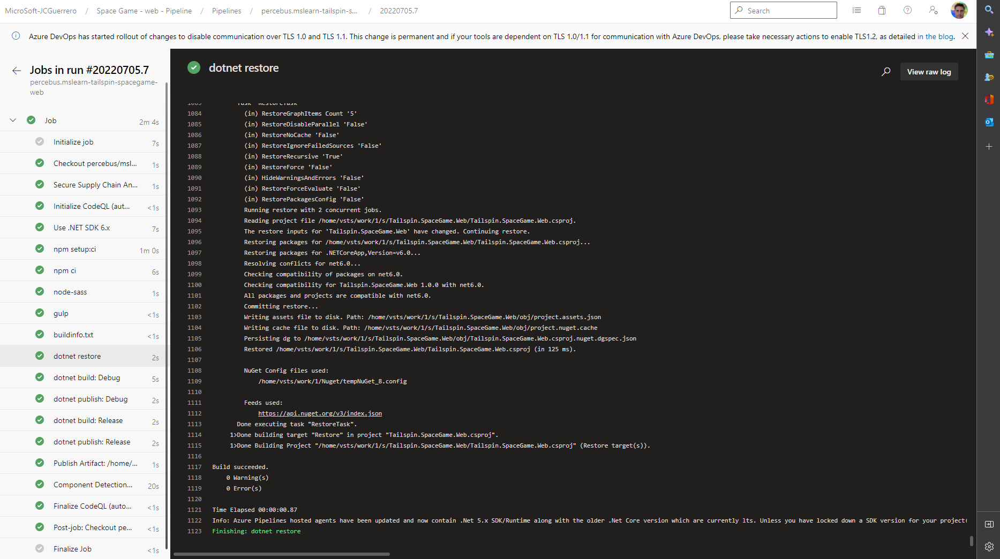

# TailSpin SpaceGame (Web)

Forked from [github.com/MicrosoftDocs/mslearn-tailspin-spacegame-web](https://github.com/MicrosoftDocs/mslearn-tailspin-spacegame-web)

## Setup

### First time

```bash
$> npm run setup
```

### Dependencies

```bash
$> npm install
```

## `dotnet`

### Configurations

* `Debug`
* `Release`

### Build

```bash
$> npm run dotnet:build:(Debug|Release)
```

### Publish

```bash
$> npm run dotnet:publish:(Debug|Release)
```

## CI/CD

### Azure Pipelines



## 'To-Do's

See [TODO](./TODO.md)

## Contributing

See [CONTRIBUTING](./CONTRIBUTING.md)

## Legal Notices

See [LEGAL_NOTICE](./LEGAL_NOTICE.md)
